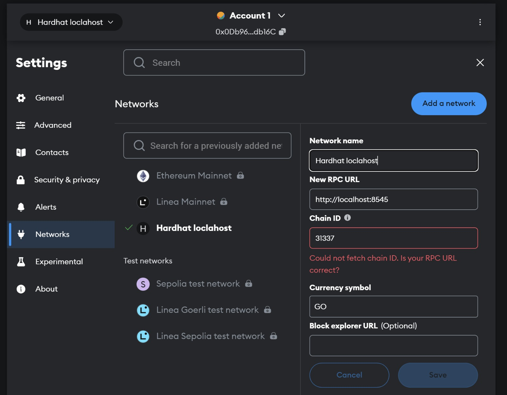
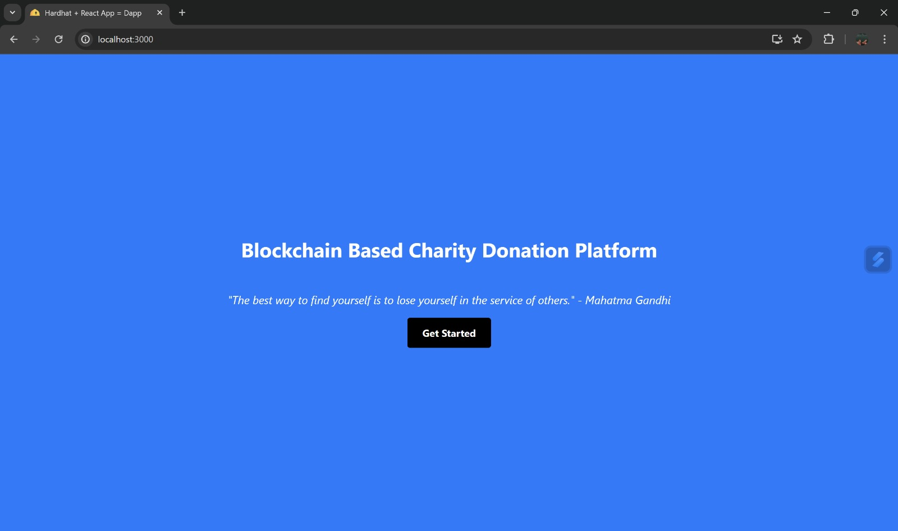
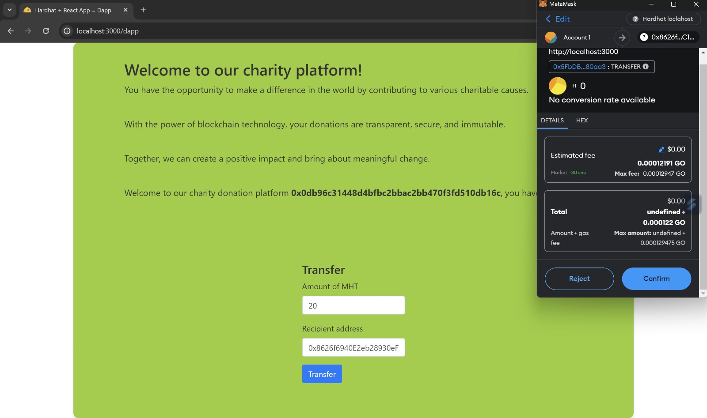
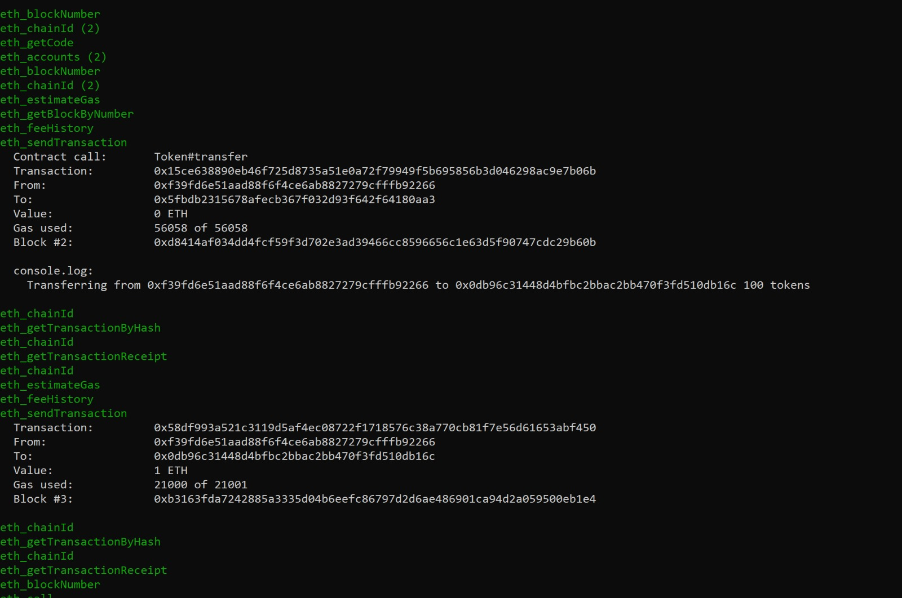

# Blockchain-Based Charity Donation Platform

## Introduction
- This project is a blockchain-based charity donation platform that allows users to donate to charities and track their donations.
- The platform uses a blockchain to store donation transactions and smart contracts to manage the donation process.
- It also includes a web interface for users to view and track their donations.

## Features
- Users can create an account and donate to charities.
- Users can view their donation history and track their donations.
- Charities can create an account and receive donations.
- Charities can view their donation history and track their donations.
- The platform utilizes smart contracts to manage the donation process.
- The platform utilizes a development test network using blockchain to store donation transactions.

## Technologies
- Solidity
- Truffle
- Hardhat
- Web3.js
- React

## Installation
1. Clone the repository.

2. Set up metamask.
  - Install the Metamask browser extension.
  - Create an account and set up a wallet.
  - Connect Metamask to the Hardhat Network by importing a new account using a private key from Hardhat Network.
  - Configure Metamask to connect to the local development network by selecting "Custom RPC" and entering the network details.
    

3. Install the dependencies.
  - First, clone the repository.
  - Run `npm install` to install the project's dependencies.
  - Spin up an instance of Hardhat Network by running `npx hardhat node`.

4. Go to a different terminal and run the following commands:
  - In a different terminal in the same directory, run `npx hardhat run scripts/deploy.js --network localhost` to deploy the contract to Hardhat Network.
  - After the deployment completes, navigate to the `frontend` directory.
  - Run `npm install` to install the dependencies for the React web app.
  - Finally, run `npm run start` to start the web app.

5. Open your browser and navigate to `http://localhost:3000` to view the web app.

## Screenshots

### Homepage

### Sending Money

### Backend Network

